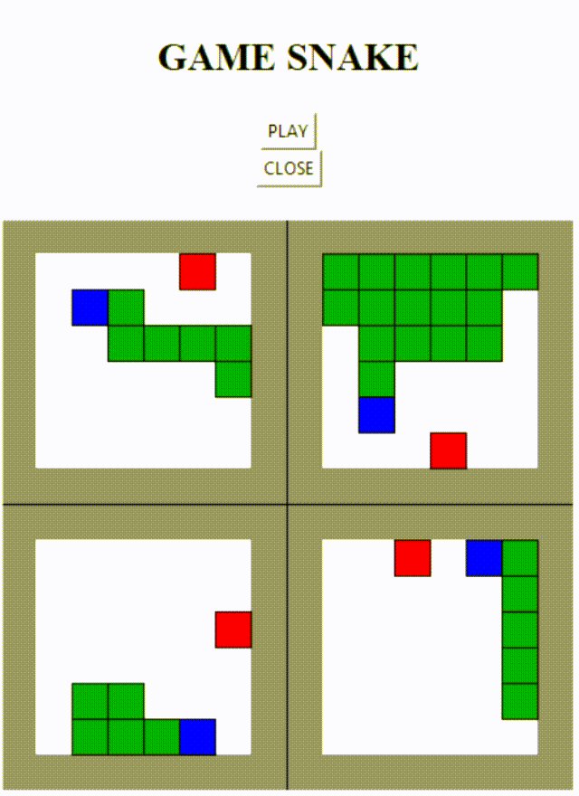
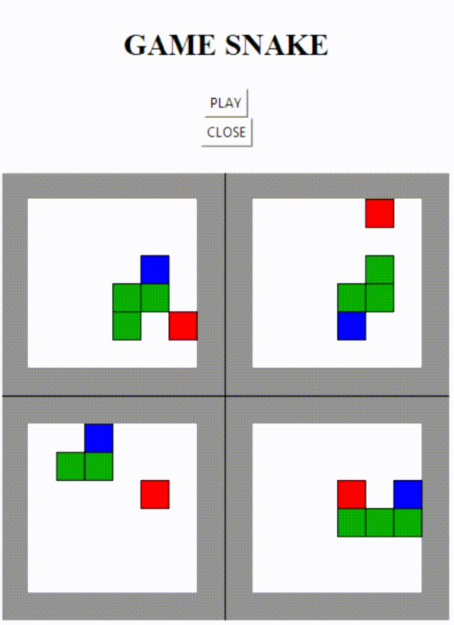

# Deep Reinforcement Learning Agent plays Snake

Q-learning Agent learns to play Snake with Deep Neural Network and CNN on Tkinter User Interface

Author: Corentin MORVAN--CHAUMEIL

## Simulation of Snake Environment & Tkinter User Interface

The game of Snake is implemented following the famous rules: when the snake eats the food, it grows, and when it runs into walls or its own body it dies. For computation reasons concerning training of CNN, I chose to limit the game to 8x8 dimensions.

Thanks to Tkinter, I create a user interface where walls are displayed in grey, snake head is blue, snake body is green, food is red, and all empty spaces are white. Two buttons "PLAY" and "CLOSE" enable to start simmulation or to close Tkinter user interface.

The interface has 3 different operating modes:
- playable mode: only one Snake game is shown and you can control it with keyboard arrows 
- visualization mode: you can observe how a pretrained model behave on 4 different Snake games, at the same time
- trainable mode: many snakes are playing (but only 4 shown) and the Reinforcement Learning agent learns how to play by training a model (neural network)

## Q-learning Agent

To improve the model, RL agent uses Q-learning method to update weights of the neural network. Indeed, since the number of states is too big, here you do not use action-value table; instead, you use neural network model.
To train this network, you need to define a reward for each action taken by your agent because it is not a supervised learning task: the agent do not know which strategy to set up, or which action is a good or bad decision. By using a reward and Q-learning, your model is train to maximize reward both in short-term between each action, but also in the long term by estimating the value or future possible states.

To do that, I created the following reward function:
- reward = +1 when snake eats food
- reward = -1 when snake runs into walls
- reward = -1 when snake runs into its own body
- reward = -0.01 the rest of the time in order to incitate snake to reach food as quick as possible

## Deep Neural Networks

To make the RL agent learn, I used 2 types of neural network.

### Simple 3-layers Neural Network

The first neural network is a simple 3-hidden-layers; each one made of 150 neurons with ReLU activation. The last layer is a 3-neurons layer with softmax activation, in order for the agent to take a decision among 3 possible actions (go straight ahead, turn right, turn left).

Model Architecture:

As input, the neural network get vectors of 21 data. These 21 data correspond to distances between head of snake and food (7 distances: right, left, front, front/right, front/left, back/right, back/left), distances between head of snake and walls (7 distances) and distances between head of snake and its own body (7 distances).

Thanks to that, he is able to learn to grow by hitting food, avoiding walls and its own body.

Here is some examples of agent playing after some training (training was stop when epsilon = 1% and reduction factor of epsilon was 0.99 every 64 steps of all simulated snakes):

### Convolutional Neural Network

The second neural network is a convolution neural network with 3 Conv2D layers and 2 dense hidden-layers. The last layer is a 3-neurons layer with softmax activation, in order for the agent to take a decision among 3 possible actions (go straight ahead, turn right, turn left).

Model Architecture:

The model is supposed to take 4 images as input: the current frame and the last 3 frames in order, for the model, to take into account the direction of the snake. This configuration has been proven, by DeepMind researchers, to work better on Atari games.
Here, instead of using real images of the the user interface, I use matrices of the game state. It avoids having to save and load .png frames from Tkinter user interface, which takes long time for each iteration (~ around 0.5 on my computer). Moreover, it enables me to make easily 8x8 matrices of the game state; it is very useful between CNN are very long to train and I only use my laptop to do so, thus having small frames (8x8 pixels) enables me to get a quicker training than if I had bigger frames (84x84 for instance). 

Here is some examples of agent playing after training:

## Results

Two models are pretrained in "saved_models" folder, so you can try simulations on your own laptop. One for the the simple neural network "DNN.h5", one for the convolution network "CNN.h5".

Nevertheless, you can notice that the DNN is better than the CNN one. Indeed, if you want to train your own model, you have to keep in mind that training a CNN is very long before having some good results; especially if you do not have a GPU, like me.
